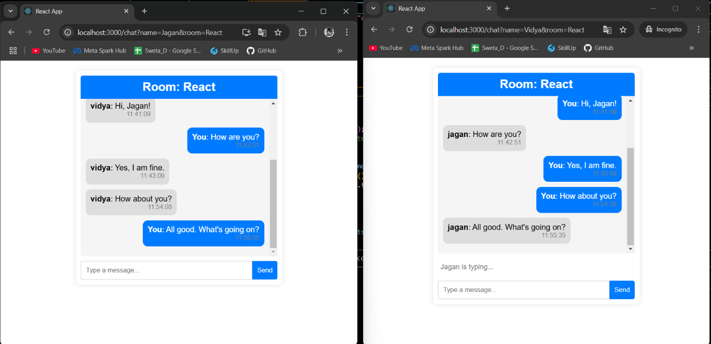

**💬 Real-Time Chat Application**

A **real-time chat application** with user-based rooms, built using
**Node.js, React.js, Socket.io, and Socket.io-client**. Users can join
different rooms, send messages, and see real-time typing indicators.

**🚀 Features**

✅ **Join Rooms:** Users can join different chat rooms dynamically.\
✅ **Real-Time Messaging:** Instant message updates using
**Socket.io**.\
✅ **Typing Indicator:** Shows when a user is typing.\
✅ **User-Friendly UI:** Simple and intuitive chat interface.\
✅ **Auto-Scroll:** Messages automatically scroll to the latest one.

**🛠️ Tech Stack**

-   **Frontend:** React.js, Socket.io-client

-   **Backend:** Node.js, Express, Socket.io

Fig 1. Chat-App-Preview
